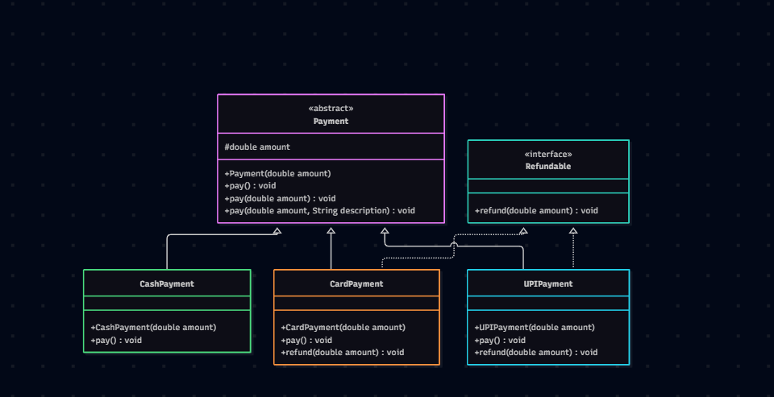

# Payment Hierarchy

## Objective

Demonstrate Java OOP concepts using a payment hierarchy.

## Concepts

* Abstraction using the `Payment` abstract class
* Inheritance using `CardPayment`, `UPIPayment`, and `CashPayment`
* Interface implementation using `Refundable`
* Method overloading using multiple `pay()` methods
* Git branching, merge conflict resolution, and rebasing

## Run

Run `Main.java` from IntelliJ IDEA.

## UML Class Diagram

The following UML diagram represents the payment hierarchy,
including abstraction, inheritance, interface implementation,
and method overloading.

